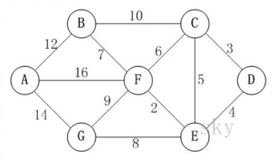
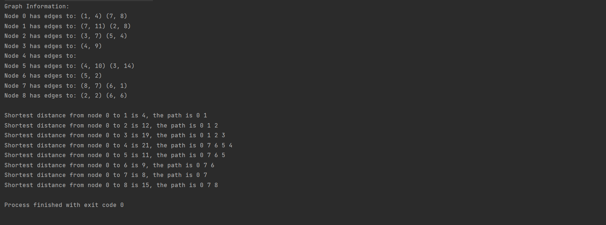

# Dijkstra Algorithm

## Description
Dijkstra's Algorithm is an algorithm used to solve the single source shortest path problem, which uses greedy algorithms to gradually expand the set of known shortest paths until reaching the target node.



## Gold
Given a weighted directed graph and a source node to find the shortest path from the source node to all other nodes in the graph.

## Pseudocode

```
Dijkstra(Graph G, Node s)
    for each vertex v in V
        D[v] = G.weight(s, v) // ∞ for unreachable
    S = {s}
    while (V - S is not empty)
        u = Cheapest vertex reachable from V - S
        S.add(u)
        for each vertex v adjacent to u
            if (D[v] > D[u] + G.weight(u, v))
                D[v] = D[u] + G.weight(u,v)
```
### Algorithmic principle
The Dijkstra algorithm uses a greedy algorithm to gradually expand the set of known shortest paths until reaching the target node. Specifically, the algorithm maintains a distance array that records the shortest distance from the starting node to each node, as well as a set that records the nodes that have determined the shortest path. At each step, the algorithm selects the node with the smallest distance in the distance array that is not in the set, adds it to the set, and updates the distance array to reflect the shortest path from the starting node to that node.
>

## Operation
- The initialization distance actually refers to the distance between the point directly connected to D. Dis [c] represents the shortest distance from point D to point C, therefore the initial dis [C]=3, dis [E]=4, dis [D]=0, and the rest are infinite. Set set S to represent the shortest path that has been found. At this point, S={D}. Now we obtain the distances from point D to each point {D (0), C (3), E (4), F (*), G (*), B (*), A (*)}, where * represents the unknown or can be said to be infinite, and the values in parentheses represent the shortest distance from point D to that point.

- Do not consider the values in set S, as dis [C]=3 is the shortest distance in the middle, so update S, S={D, C}. Next, we look at the points connected to C, which are B, E, F, and those that are already in set S, dis [C-B]=10. Therefore, dis [B]=dis [C]+10=13, dis [F]=dis [C]+dis [C-F]=9, dis [E]=dis [C]+dis [C-E]=3+5=8>4 (dis [E]=4 during initialization) are not updated. At this point {D (0), C (3), E (4), F (9), G (*), B (13), A (*)}.

- In step 2, the value of point E is the smallest, and S={D, C, E} is updated. At this point, the points directly connected to point E are F and G, respectively. Dis [F]=dis [E]+dis [E-F]=4+2=6 (smaller than the original value, updated), dis [G]=dis [E]+dis [E-G]=4+8=12 (updated). At this point {D (0), C (3), E (4), F (6), G (12), B (13), A (*)}.

- In step 3, the value of point F is 6, and S={D, C, E, F} is updated. At this point, the points directly connected to point F are B, A, and G. Dis [B]=dis [F]+dis [F-B]=6+7=13, dis [A]=dis [F]+dis [F-A]=6+16=22, dis [G]=dis [F]+dis [F-G]=6+9=15>12 (not updated). At this point {D (0), C (3), E (4), F (6), G (12), B (13), A (22)}

- In step 4, the value of point G is the smallest, and S={D, C, E, F, G} is updated. At this point, the only point directly connected to point G is A. Dis [A]=dis [G]+dis [G-A]=12+14=26>22 (not updated). {D (0), C (3), E (4), F (6), G (12), B (13), A (22)}

- In step 5, the value of point B is the smallest, and S={D, C, E, F, G, B} is updated. At this point, the only point directly connected to point B is A. Dis [A]=dis [B]+dis [B-A]=13+12=25>22 (not updated). {D (0), C (3), E (4), F (6), G (12), B (13), A (22)}
Finally, only A value remains, and we directly enter the set S={D, C, E, F, G, B, A}. At this point, all points have been traversed and the final results {D (0), C (3), E (4), F (6), G (12), B (13), A (22)} are obtained.

## Algorithm implement
The Implementation of Algorithms in C++
```
void dijkstra(Graph& G, int s, vector<int>& D, vector<int>& prev) {
    int n = G.adj.size();
    vector<bool> visited(n, false);

    // Initialize distance array
    D.assign(n, INF);
    prev.assign(n, -1);
    D[s] = 0;

    // Priority queue for sorting by distance
    priority_queue<pair<int, int>, vector<pair<int, int>>, greater<pair<int, int>>> pq;
    pq.push({0, s});

    while (!pq.empty()) {
        int u = pq.top().second;
        pq.pop();

        if (visited[u]) continue;
        visited[u] = true;

        // Update distances to adjacent vertices of u
        for (const Edge& e : G.adj[u]) {
            int v = e.to;
            int w = e.weight;
            if (D[v] > D[u] + w) {
                D[v] = D[u] + w;
                prev[v] = u;
                pq.push({D[v], v});
            }
        }
    }
}

```

## Time complexity
For a graph with V vertices and E edges, the time complexity of the Dijkstra algorithm is:
- Implement using adjacency matrix: O(V<sup>2</sup>).
- Implement priority queue using binary heap: O((V+E)logV) .
### Worse case
The worst-case time complexity is O((V<sup>2</sup> + E) log V). This is because even with heap optimization, each vertex may be inserted, deleted, and updated, with each of these operations having a time complexity of log V. If E approaches V<sup>2</sup>, then the overall complexity of heap operations may approach O(V<sup>2</sup> log V).

## Algorithm application
Dijkstra Algorithm is commonly used in search engines. Many websites use this algorithm to generate product links or push videos that users may be interested in. 
>
Another application of Dijkstra in daily life is reflected in logistics and transportation. Logistics companies typically use this algorithm to optimize routes, allocate goods, manage traffic flow, and other areas to improve efficiency and reduce costs.


## Output

### Graph Information:


