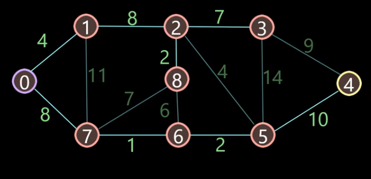

# Dijkstra Algorithm

## Description
Dijkstra's Algorithm is an algorithm used to solve the single source shortest path problem, which uses greedy algorithms to gradually expand the set of known shortest paths until reaching the target node.



## Gold
Given a weighted directed graph and a source node to find the shortest path from the source node to all other nodes in the graph.

## Pseudocode

```
Dijkstra(Graph G, Node s)
    for each vertex v in V
        D[v] = G.weight(s, v) // ∞ for unreachable
    S = {s}
    while (V - S is not empty)
        u = Cheapest vertex reachable from V - S
        S.add(u)
        for each vertex v adjacent to u
            if (D[v] > D[u] + G.weight(u, v))
                D[v] = D[u] + G.weight(u,v)
```
>
## Results

### Graph Information:
- Node 0 has edges to: (1, 4) (7, 8) 
- Node 1 has edges to: (7, 11) (2, 8) 
- Node 2 has edges to: (3, 7) (5, 4) 
- Node 3 has edges to: (4, 9) 
- Node 4 has edges to: 
- Node 5 has edges to: (4, 10) (3, 14) 
- Node 6 has edges to: (5, 2) 
- Node 7 has edges to: (8, 7) (6, 1) 
- Node 8 has edges to: (2, 2) (6, 6) 

### Shortest Paths from Node 0:
- Shortest distance to node 1 is 4, the path is 0 1
- Shortest distance to node 2 is 12, the path is 0 1 2
- Shortest distance to node 3 is 19, the path is 0 1 2 3
- Shortest distance to node 4 is 21, the path is 0 7 6 5 4
- Shortest distance to node 5 is 11, the path is 0 7 6 5
- Shortest distance to node 6 is 9, the path is 0 7 6
- Shortest distance to node 7 is 8, the path is 0 7
- Shortest distance to node 8 is 15, the path is 0 7 8

